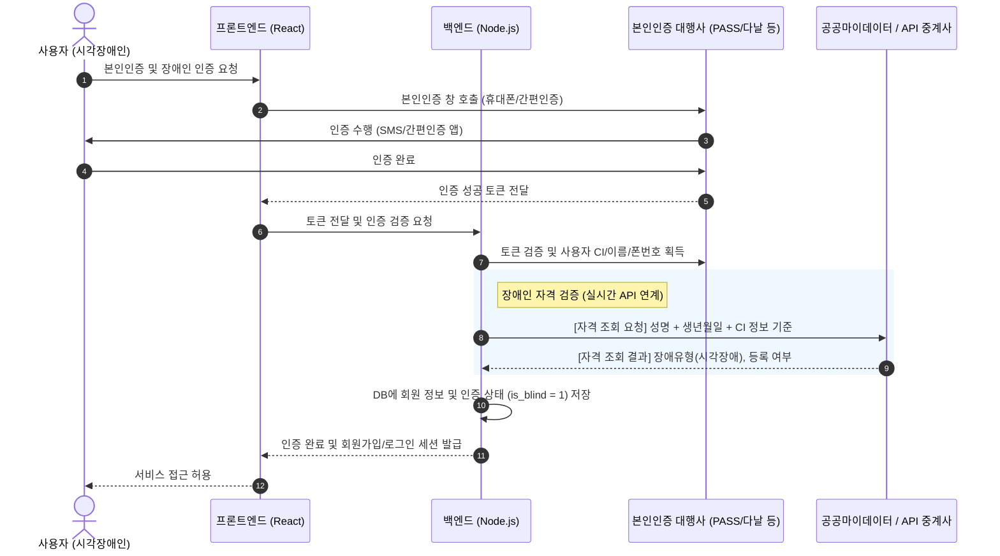
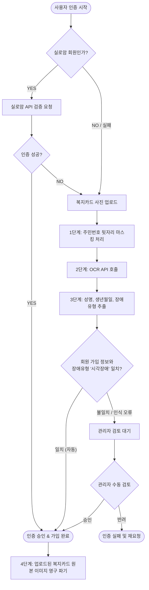

# 시각장애인 자격 인증 및 개인 식별 시스템 설계안

본 문서에서는 `blindmom.org` 서비스 내에서 사용자가 시각장애인임을 공인된 타 기관을 통해 확인하고 개인을 식별하기 위한 아키텍처 및 구현 방안을 정의합니다.

---

## 1. 개인 식별 및 본인인증 아키텍처

주민등록번호는 법적 근거 없이 수집할 수 없으므로, 방송통신위원회 지정 본인확인기관(또는 OIDC 간편인증)을 통해 고유 식별값(CI/DI)을 획득하고 실명을 확인합니다.



---

## 2. 장애인 자격 검증 연계 방안 (4가지 Option)

### Option A: 행정안전부 공공마이데이터 연계 (권장)
*   **방식:** 사용자가 본인인증 및 개인정보 제공 동의를 수행하면, 행정안전부의 "비대면 자격확인 서비스" API를 직접 연계하여 장애인 자격을 실시간으로 조회합니다.
*   **데이터 필드:** 성명, 생년월일, 장애인 여부, 장애 정도(중증/경증), 장애 유형(시각장애).
*   **장점:** 정부 공식 데이터로 가장 공신력이 높고 호출 비용이 무료 또는 저렴함.
*   **단점:** `blindmom.org` 운영 주체(비영리 사단법인 등)가 행정정보 공동이용 권한을 신청하고 승인받는 행정적 절차(약 2~4주)가 필요합니다.

### Option B: 민간 데이터 중계사 API 활용 (빠른 도입)
*   **방식:** 코드에프(Codef), 쿠콘(Coocon) 등 민간 API 제공 업체의 "장애인 증명서 진위확인" 또는 "자격조회" API를 도입합니다.
*   **장점:** 행정 절차가 간소하며, 제공되는 SDK/API 명세를 통해 신속하게 구현할 수 있습니다.
*   **단점:** 호출당 수수료(건당 비용)가 발생합니다.

### Option C: Gemini 멀티모달 API 기반 복지카드 검증 (강력 권장 Fallback)
*   **방식:** 사용자가 복지카드를 촬영하여 업로드하면, 이미 백엔드에 탑재된 Gemini API(`gemini-2.5-flash` 등)의 멀티모달 비전 기능을 활용해 이미지에서 실명, 생년월일, 시각장애 여부를 직접 판독하고 검증합니다.
*   **장점:**
    *   **도입 비용 Zero:** 새로운 플랫폼(NCP 등) 가입 및 신용카드 등록, API Gateway 연동 작업이 필요 없이 기존 Google AI 인프라를 즉시 재사용합니다.
    *   **비용 효율성:** `gemini-2.5-flash` 기준 이미지 1장당 처리 비용이 **0.2원~0.5원 수준**으로 일반 OCR(건당 3원) 대비 10배가량 저렴합니다.
    *   **구조화된 출력(Structured JSON):** 텍스트를 단순 추출한 뒤 백엔드에서 어렵게 파싱할 필요 없이, 프롬프트 지시를 통해 이름, 생년월일, 시각장애인 여부를 구조화된 JSON 데이터로 깔끔하게 즉시 반환받을 수 있습니다.
*   **단점:** 
    *   초당 API 제한(Rate Limits) 정책에 영향을 받을 수 있으나, 가입 단계의 트래픽 규모로는 무시할 수 있는 수준입니다.
    *   간혹 LLM 환각(Hallucination)에 의한 오독이 생길 수 있으므로, 판독 신뢰도가 임계치 이하이거나 확실하지 않을 경우 수동 검토 상태(`AdminReview`)로 보류하는 보완 로직을 설계합니다.

### Option D: 유관 기관(실로암시각장애인복지관 등) 회원 DB 연계 (제휴 기반)
*   **방식:** 실로암복지관 등 공인된 시각장애인 단체와 MOU를 맺고, 그들이 보유한 회원 DB에 접근할 수 있는 전용 검증 API(ID/이름/생년월일 매칭) 혹은 SSO(OAuth2 등)를 연동합니다.
*   **장점:** 
    *   공공데이터 연동(Option A/B) 대비 비용이 발생하지 않거나 저렴함.
    *   이미 타 기관에서 장애 여부가 인증된 회원이므로 추가적인 2차 본인인증(PASS 등)을 직접 고비용으로 연동할 필요 없이, 해당 기관 계정 로그인만으로 간편하게 인증 완료 가능.
*   **단점:**
    *   기관과의 행정 및 비즈니스적 제휴 협약(MOU) 선결이 필수적이며, 개인정보 제3자 제공 동의 처리가 수반되어야 함.
    *   상대 기관에 연동 가능한 API 시스템이 구축되어 있지 않다면 커스텀 API 설계 및 개발 비용이 상대측 혹은 양사 간에 발생할 수 있음.
    *   특정 기관 비회원은 인증할 수 없으므로 여전히 Option C와 같은 Fallback 수단이 필요함.

---

## 2.5 실로암 DB + 복지카드 OCR 하이브리드 인증 모델 설계

실로암 DB에 등록되지 않은 시각장애인 사용자를 위해 복지카드 OCR을 연계한 하이브리드 인증 프로토콜은 다음과 같습니다.



### 복지카드 OCR 도입 시 필수 보안 기술 요건

1. **주민등록번호 수집 금지 (법적 준수)**
   * **Client-Side/Server-Side 마스킹:** 사용자가 카드 사진을 업로드할 때 가이드라인 영역을 제공하여 주민번호 뒷자리를 마스킹하도록 안내하거나, 백엔드 서버에 이미지 로드 즉시 주민번호 영역의 픽셀을 강제로 마스킹(블랙박스 처리)합니다.
2. **이미지 즉시 파기 (Data Minimization)**
   * OCR 텍스트 추출 작업 및 관리자 승인(불일치 시) 처리가 완료된 즉시, 업로드된 복지카드 원본 이미지 파일은 서버 스토리지(S3, 로컬 디렉토리 등)에서 **완전 삭제(Shred/Purge)**되어야 합니다.
   * 백엔드 DB에는 이미지 파일 경로를 남기지 않고, 최종 결과인 `is_blind: 1`과 인증 일시만 기록합니다.
3. **추천 OCR 엔진**
   * **Naver CLOVA OCR:** 주민등록증/복지카드 등 국내 서식 인식률이 가장 뛰어남.
   * **Google Cloud Vision API:** 일반 텍스트 추출용으로 비용이 저렴하나, 복지카드 양식에 맞춘 후처리 파싱 코드 작성 필요.

### 타인 정보 도용 및 무차별 대입(Brute-Force) 방어 아키텍처

#### [방안 A] OIDC/휴대폰 본인인증 도입 시 (최상의 시나리오)
* **Zero Trust Input:** 사용자가 타이핑한 임의 값이 아닌, 본인확인 대행사(PASS 등)가 검증 완료한 세션 데이터(`name`, `birthdate`, `phone`)만 추출하여 실로암 API로 전송합니다. 이 경우 타인 도용이 원천적으로 불가능합니다.

#### [방안 B] 본인인증 미도입 시 (현실적 대체 통제안)
비용 및 절차상의 이유로 PASS 등 2차 본인인증을 적용하지 못하고 사용자의 수동 입력 값에 의존해 실로암 API를 호출할 경우, 아래 4가지 보안 장치를 백엔드 인프라에 반드시 적용해야 합니다.

1. **IP 및 계정 단위의 강력한 요청 속도 제한 (Rate Limiting)**
   * 동일 IP 대역 또는 동일 가입 시도 세션에 대해 **하루 최대 3회~5회**로 가입/인증 요청 횟수를 강하게 제한합니다. 
   * 단시간에 대량의 데이터를 대입하여 조회하는 행위를 인프라단에서 차단합니다.
2. **구글 reCAPTCHA v3 연동 (봇 차단 & 접근성 확보)**
   * 시각장애인의 웹 접근성을 해치지 않기 위해 글자 입력이나 그림 맞추기가 없는 **reCAPTCHA v3**를 백그라운드에 탑재합니다.
   * 사용자 행동 패턴을 분석하여 점수(Score 0.0 ~ 1.0)를 반환받고, 매크로/봇으로 의심되는 낮은 점수의 요청은 백엔드 진입 전 차단합니다.
3. **인위적인 응답 지연 강제 (Tar Pit 기법)**
   * 백엔드는 실로암 API를 호출하기 전 의도적으로 **1.5초~2초의 강제 대기(delay/sleep)**를 수행합니다.
   * 일반 사용자의 가입 지연은 체감이 미미하지만, 대량의 대입 공격을 수행하는 매크로 엔진에는 초당 처리량(QPS)을 극단적으로 제한하여 무차별 대입 공격의 효율성을 무력화시킵니다.
4. **실패율 기반 이상 감지 차단 (Anomaly Detection)**
   * 실로암 검증 API 단에서 `blindmom.org`로부터 온 요청 중 **최근 1시간 내 연속 5회 이상 인증 실패(불일치)**가 발생하면, 공격 징후로 판단하여 해당 키/세션을 임시 차단(Block)하고 관리자 알림을 트리거합니다.

#### [공통] 네트워크 보안 통제
* 실로암 검증 API 서버 방화벽에서 `blindmom.org` 백엔드 서버의 고정 IP만 통과되도록 통제하여, 외부 해커의 API 직접 타격을 방어합니다.
* 가입 인증 실패 시 에러 사유를 구체적으로 분기하여 응답하지 않고(예: '생년월일 다름', '휴대폰 다름' 등 구체적 분기 금지), 일괄적으로 `AUTH_FAILED`로만 응답하여 정보 유추 힌트를 주지 않습니다.

---

## 3. 데이터베이스 스키마 확장 제안 (SQLite)

회원 정보 및 인증 이력을 관리하기 위해 기존 스키마에 `users` 및 `user_verifications` 테이블을 추가합니다.

```sql
-- 회원 테이블
CREATE TABLE IF NOT EXISTS users (
  id TEXT PRIMARY KEY,               -- UUID or 식별 ID
  ci TEXT UNIQUE NOT NULL,           -- 본인인증 기관 연계정보 (고유 식별키)
  di TEXT,                           -- 중복가입확인정보
  name TEXT NOT NULL,                -- 실명
  phone TEXT NOT NULL,               -- 연락처
  birthdate TEXT,                    -- 생년월일 (YYYY-MM-DD)
  is_blind INTEGER DEFAULT 0,        -- 시각장애인 인증 여부 (0: 미인증, 1: 인증)
  created_at DATETIME DEFAULT CURRENT_TIMESTAMP,
  updated_at DATETIME DEFAULT CURRENT_TIMESTAMP
);

-- 인증 상세 기록 테이블 (감사 추적용)
CREATE TABLE IF NOT EXISTS user_verifications (
  id INTEGER PRIMARY KEY AUTOINCREMENT,
  user_id TEXT NOT NULL,
  verification_method TEXT NOT NULL, -- 'public_mydata', 'codef_api', 'card_ocr'
  status TEXT DEFAULT 'pending',     -- 'pending', 'approved', 'rejected'
  details TEXT,                      -- API 응답 json 데이터 또는 복지카드 파일 경로
  verified_at DATETIME,
  FOREIGN KEY (user_id) REFERENCES users (id) ON DELETE CASCADE
);
```

---

## 4. 향후 의사결정 및 확인 필요 사항

> [!IMPORTANT]
> 1. **운영 주체의 법적 지위:** 공공마이데이터(Option A) 권한 신청을 위해 `blindmom.org`가 법인 등록이 되어 있는지, 혹은 개인 사업자 상태인지 확인이 필요합니다.
> 2. **예산 수준:** 민간 API(Option B) 사용 시 발생하는 건당 호출 비용 감당 여부.
> 3. **보안/개인정보 처리 및 법적 규제 준수 (Compliance)**
   * **민감정보 처리 동의:** 장애 유형 정보는 법률상 '민감정보'에 해당하므로, 별도의 필수 동의 항목을 구현해야 합니다.
   * **주민등록번호 수집 제한 준수:** 복지카드 원본에 포함된 주민등록번호는 법적 근거 없이 수집·처리할 수 없습니다. 따라서 **Google API로 이미지를 전송하기 전에 주민등록번호 영역을 서버 또는 클라이언트 브라우저에서 물리적으로 완전 마스킹(가리기)** 처리해야 법적 위반 소지를 차단할 수 있습니다.
   * **국외 이전 및 데이터 학습 방지:** 
     * Gemini API 서버가 해외에 위치하므로 **'개인정보의 국외 이전 동의'** 항목을 약관에 명시해야 합니다.
     * 무료 Tier API Key 사용 시 구글 측의 학습 데이터로 활용될 여지가 있으므로, 실 서비스 배포 시에는 반드시 **유료 Billing이 설정된 API(또는 Vertex AI) 환경**을 연동하여 데이터가 모델 학습에 활용되지 않도록 제어해야 합니다.

---

## 5. 시스템 릴리즈를 위한 부가 구성요소 제안

성공적인 회원제 도입 및 시각장애인 편의성 확보를 위해 다음 4가지 추가 기능 및 연동 고려가 권장됩니다.

### 5.1. 관리자(Admin) 대시보드 내 회원 관리 & 예외 승인 기능
* **필요성:** 복지카드 판독 실패 건(`AdminReview` 상태)의 예외 처리를 위해 필수적입니다.
* **스펙:**
  * 가입 대기 회원 리스트 조회.
  * 복지카드 OCR 결과 및 마스킹된 복지카드 업로드 이미지 대조 확인.
  * 수동 승인(`is_blind: 1`) 및 반려(반려 사유 입력 후 SMS/이메일 발송 연계) 기능.

### 5.2. 세션 유지 및 자동 로그인 (UX 최적화)
* **필요성:** 시각장애인 사용자가 매번 로그인 ID/PW를 치는 것은 매우 피로도가 높은 작업입니다.
* **스펙:**
  * 모바일 기기 친화적인 자동 로그인(Refresh Token 기반 세션 유지) 도입.
  * 로그인 유지 세션 만료 시간을 타이트하게 가져가지 않고 최소 30일 이상 넉넉하게 보장.

### 5.3. 레거시 비회원 데이터 마이그레이션 및 연동
* **필요성:** 현재 와글와글 게시판(`posts`) 및 영상 댓글(`comments`)은 닉네임/비밀번호 방식의 비회원으로 작성됩니다.
* **스펙:**
  * 가입한 회원이 글/댓글 작성 시 비밀번호 입력창을 제거하고 세션의 `user_id`를 외래키로 저장하도록 DB 스키마 수정.
  * 비회원이 회원가입 시, 기존에 작성했던 글들의 비밀번호 일치 조회를 거쳐 내 계정 데이터로 가져오는 마이그레이션(소유권 병합) 기능 검토.

### 5.4. 스크린 리더(VoiceOver, Talkback) 웹 접근성 최적화
* **필요성:** 웹 접근성 표준을 준수하지 않으면 시각장애인이 가입조차 할 수 없습니다.
* **스펙:**
  * 가입/로그인 폼 필드의 에러 상태(예: "이미 사용 중인 전화번호입니다.")를 스크린리더가 즉시 감지하여 읽도록 `aria-live="polite"` 속성 및 `aria-describedby` 연결.
  * 마스킹 가이드 및 사진 촬영 업로드 단계에 정밀한 음성 안내 가이드라인 스크린리더 전용 텍스트(`sr-only`) 배치.

---

## 6. 개발 및 릴리즈 마일스톤 (MVP 스코프)

의사결정된 우선순위에 따라 다음과 같은 단계적 마일스톤으로 나누어 구현을 진행합니다.

### 1단계: 가입 페이지 구축 (회원가입 및 시각장애인 인증)
* **프론트엔드:** 회원 정보 입력 양식 UI, 실로암 API 연동 인증 UI, 복지카드 촬영/업로드 UI 구축.
* **백엔드:** 가입 API, 실로암 검증 API 클라이언트 연동, Fallback 용 복지카드 Gemini OCR 판독 파이프라인(마스킹 및 자동 판독), DB 스키마 생성 및 회원정보 저장 로직 구현.

### 2단계: 권한 분리 적용
* **정책:**
  * 이미 대본이 생성 완료된 비디오는 비회원/회원 구분 없이 누구나 재생 가능.
  * 대본이 존재하지 않는 신규 비디오에 대한 자동 생성 요청은 **로그인 및 인증된 시각장애인 회원**으로만 제한.
* **구현:** 비회원이 대본 생성을 시도할 경우, 생성 차단 팝업을 노출하고 로그인 페이지로 유도.

### 3단계: 로그인 페이지 구현
* **스펙:** PC 및 모바일 기기에서의 이메일/비밀번호 로그인 처리.
* **보안/편의:** 장기 세션 유지 및 자동 로그인 인프라 구축.

### 4단계: 관리자(Admin) 회원 관리 페이지 구축
* **스펙:** `AdminReview` 상태(OCR 판독 실패 혹은 애매함)의 가입 신청 건 목록 조회 및 마스킹된 카드 이미지 대조 수동 승인/반려 웹 화면 개발.

---
